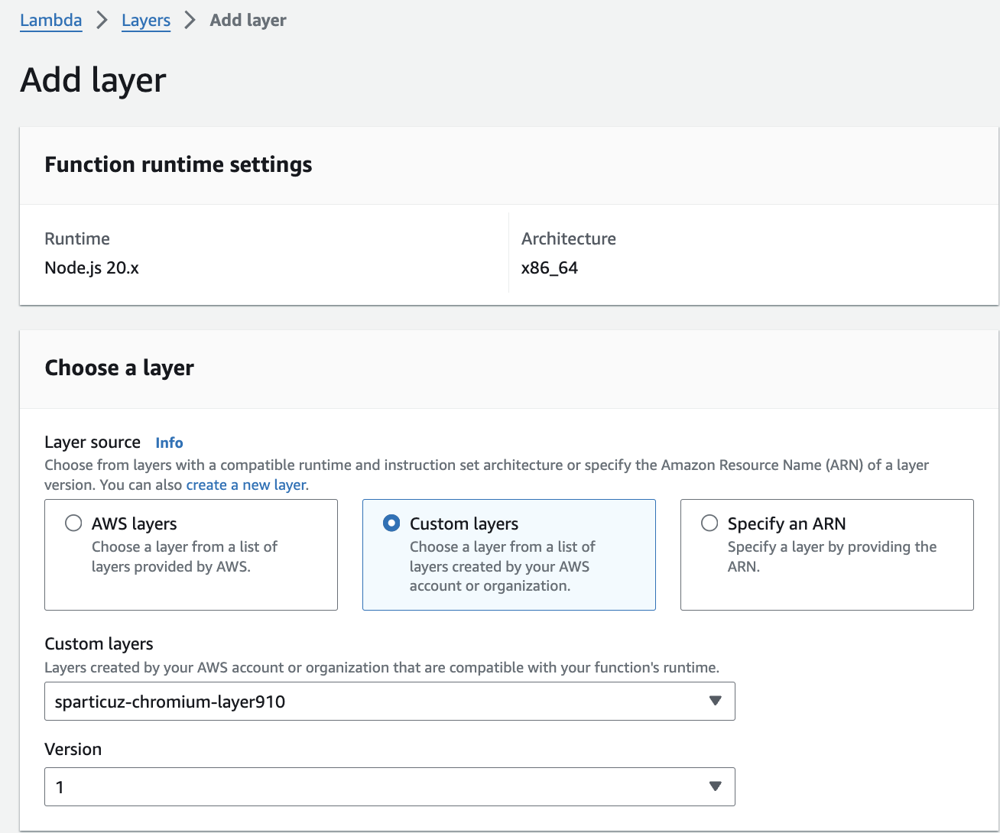

# playwright-lambda-environment

This is a example of how to get Playwright working with AWS Lambda by using [sparticuz/chromium](https://github.com/Sparticuz/chromium).  
  
See [sparticuz/chromium](https://github.com/Sparticuz/chromium) for up-to-date information.

## initialize your project

```sh
cd path/to/project
npm init -y
npm install playwright typescript
npm install -D @types/aws-lambda @types/node

npx tsc --init
```

- in tsconfig.json, add `"outDir": "./dist"`.

## make AWS Custom Lambda layer

Follow [this description](https://github.com/Sparticuz/chromium?tab=readme-ov-file#aws-lambda-layer) to create a Chrominium binary to be used from the AWS Lambda environment.

- First, you need to have an S3 bucket with a name like "chromiumUploadBucket".
- upload chromium binary to the S3
- open AWS Console and your lambda function, and set custom layer like below:

- Edit basic settings
  - Memory
    - 512 MB or more is recommended.
  - Timeout
    - Set appropriate values. In most cases, the default of 3 seconds will be too short.

## implement your code

- refer to [this section](https://github.com/Sparticuz/chromium?tab=readme-ov-file#usage-with-playwright).

## deploy the code to AWS Lambda

- the unix commands required for Deploy are listed below.
- recommend you to put them into package.json or yaml for CI.

```sh
rm -rf dist/
npx tsc
cd dist
zip -r ../deploy-package.zip ./* ../node_modules
cd ..
aws lambda update-function-code --function-name test-function --zip-file fileb://deploy-package.zip
```
